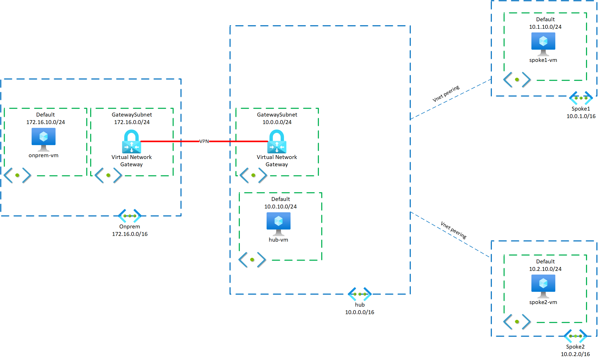

# Module 1: Building a Basic Hub And Spoke Topology

[< Previous Module](./00-Prereqs.md) - **[Home](../README.md)** - [Next Module >](./02-AzFW.md)

## Introduction

In this module you will be setting up a basic hub and spoke topology with connectivity to onprem via VPN site-to-site.

## Description

In this module you will create the topology described in this diagram:



We will be simulating the onprem environment using a VNet in Azure, and connecting to a VM deployed therein via SSH.

## Method

**_IMPORTANT: Be sure to create ALL resources in Canada Central region._**

**_IMPORTANT: If a parameter is not specified, it should not be set OR the default is acceptable._**

1. Create a resource group called `rg-hackathon-cc` in Canada Central. This resource group will contain **ALL** of the resources for this hack-a-thon. (**NOTE**: This is not how you would deploy a set of resources that have a wide variety of lifecycles in real life. We are putting it all into a single RG in this hack-a-thon because it simplifies things, particularly cleanup.)

1. Create four (4) virtual networks in the resource group with the following configurations:
   |Name|Address Space|Subnets<br>Name: Address Space|
   |---|---|---|
   |`Hub`|10.0.0.0/16|GatewaySubnet: 10.0.0.0/24 <br>default: 10.0.10.0/24<br>AzureFirewallSubnet: 10.0.1.0/24|
   |`Onprem`|172.16.0.0/16|GatewaySubnet: 172.16.0.0/24 <br>default: 172.16.1.0/24|
   |`Spoke1`|10.1.0.0/16|default: 10.1.10.0/24|
   |`Spoke2`|10.2.0.0/16|default: 10.2.10.0/24|
1. With the VNets created, create two Virtual Network Gateways with the following configurations (**NOTE**: Virtual Network Gateways take between 30-40 minutes to create once the job has been submitted. Be patient.):
   1. - Name: `vng-onprem`
      - Gateway Type: `VPN`
      - VPN Type: `Route-based`
      - SKU: `VpnGw1`
      - Virtual Network: `Onprem`
      - Public IP address: Create New
      - Public IP address name: `pip-onprem`
      - Active-active mode: `Disabled`
      - Configure BGP: `enabled`
      - ASN: `65100`
      ***
   1. - Name: `vng-cloud`
      - Gateway Type: `VPN`
      - VPN Type: `Route-based`
      - SKU: `VpnGw1`
      - Virtual Network: `Hub`
      - Public IP address: Create New
      - Public IP address name: `pip-cloud`
      - Active-active mode: `Disabled`
      - Configure BGP: `Enabled`
      - ASN: `65000`
1. Once the Virtual Network Gateways Public IP Address resources have deployed, gather the information about their public IP addresses.
1. Create two Local Network Gateways:
   1. - Name: `lng-onprem`
      - IP Address: Enter the public IP address of the **`vng-onprem`** Virtual Network Gateway
      - Configure BGP: `yes`
      - BGP ASN: `65100`
      - BGP Peer IP: `172.16.0.254`
      ***
   1. - Name: `lng-cloud`
      - IP Address: Enter the public IP address of the `vng-cloud` Virtual Network Gateway
      - Configure BGP: `yes`
      - BGP ASN: `65000`
      - BGP Peer IP: `10.0.0.254`
1. While the VNG's are deploying (or a second person can do this), deploy four VMs, one per VNet above, with the following configurations:

   1. Name: `onprem-vm`
   1. Image: Ubuntu Server 20.04 LTS - Gen 2
   1. Size: `Standard_B2s`
   1. Authentication type: Password
      - Username: `azureuser`
      - Password: `P@$$w0rd12300`
   1. Public inbound ports: None (we will configure an NSG later)
   1. VNet/subnet: `Onprem/default`
   1. Public IP: Create New
   1. NIC security group: `Basic`
   1. Public inbound ports: None (we will configure it later)
   1. Set up auto shutdown
   1. Input the following cloud-init config:
      ```yaml
      #cloud-config
      package_upgrade: true
      packages:
        - apache2
        - traceroute
      write_files:
        - path: /var/www/html/index.html
          content: "<h1>onprem-vm</h1>"
          defer: true
      ```
   1. Accept rest of defaults

   ***

   1. Name:` hub-vm`
   1. Image: Ubuntu Server 20.04 LTS - Gen 2
   1. Size: `Standard_B2s`
   1. Authentication type: Password
      - Username: `azureuser`
      - Password: `P@$$w0rd12300`
   1. Public inbound ports: None (we will connect via the onprem VM)
   1. VNet/subnet: `hub/default`
   1. Public IP: Create New
   1. NIC security group: `Basic`
   1. Public inbound ports: None (we will configure it later)
   1. Set up auto shutdown
   1. Input the following cloud-init config:
      ```yaml
      #cloud-config
      package_upgrade: true
      packages:
        - apache2
        - traceroute
      write_files:
        - path: /var/www/html/index.html
          content: "<h1>hub-vm</h1>"
          defer: true
      ```
   1. Accept rest of defaults

   ***

   1. Name: `spoke1-vm`
   1. Image: Ubuntu Server 20.04 LTS - Gen 2
   1. Size: `Standard_B2s`
   1. Authentication type: Password
      - Username: `azureuser`
      - Password: `P@$$w0rd12300`
   1. Public inbound ports: None (we will connect via the hub VM)
   1. VNet/subnet: `spoke1/default`
   1. Public IP: Create New
   1. NIC security group: `Basic`
   1. Public inbound ports: None (we will configure it later)
   1. Set up auto shutdown
   1. Input the following cloud-init config:

      ```yaml
      #cloud-config
      package_upgrade: true
      packages:
         - apache2
         - traceroute
      write_files:
         - path: /var/www/html/index.html
            content: "<h1>spoke1-vm</h1>"
            defer: true
      ```

   1. Accept rest of defaults

   ***

   1. Name: `spoke2-vm`
   1. Image: Ubuntu Server 20.04 LTS - Gen 2
   1. Size: `Standard_B2s`
   1. Authentication type: Password
      - Username: `azureuser`
      - Password: `P@$$w0rd12300`
   1. Public inbound ports: None (we will connect via the hub VM)
   1. VNet/subnet: `spoke2/default`
   1. Public IP: Create New
   1. NIC security group: `Basic`
   1. Public inbound ports: None (we will configure it later)
   1. Set up auto shutdown
   1. Input the following cloud-init config:

      ```yaml
      #cloud-config
      package_upgrade: true
      packages:
         - apache2
         - traceroute
      write_files:
         - path: /var/www/html/index.html
            content: "<h1>spoke2-vm</h1>"
            defer: true
      ```

   1. Accept rest of defaults

   ***

1. Once the VNGs are created, create the spoke peerings. Ensure that the peerings _from_ the hub have 'Use this virtual network's gateway or Route Server' set to true, and that peerings _from_ the spokes have 'Use the remote virtual network's gateway or Route Server' set to true. **NOTE**: It may not be possible to set this before the VNGs are finished deploying.
1. Once both the Virtual Network Gateways **and** the Local Network Gateways have been created, create two Connections:
1. - Connection type: `Site-to-site (IPsec)`
   - Name: `conn-cloud`
   - Virtual network gateway: `vng-onprem`
   - Local network gateway: `lng-cloud`
   - PSK: `AVerySecure&StrongKey`
   - Enable BGP: `True`
1. - Connection type: `Site-to-site (IPsec)`
   - Name: `conn-onprem`
   - Virtual network gateway: `vng-cloud`
   - Local network gateway: `lng-onprem`
   - PSK: `AVerySecure&StrongKey`
   - Enable BGP: `True`
1. Validate that the VPN gateways have connected.
1. Adjust the NSG on the NIC of `onprem-vm` to accept connections inbound from your external IP to ports 22 and 80 of the _private_ IP address of the VM (172.1.0.4)
1. Adjust the NSG's of the NICs of the "cloud VMs" to accept traffic destined to tcp/80 (HTTP) from anywhere to their local Virtual Network.

### Explore the deployed environment

1. Using SSH, log into `onprem-vm`.
1. Ensure that you can ping all three of the other cloud VMs.
1. SSH from `onprem-vm` to `spoke1-vm`.
1. Attempt to ping `spoke2-vm` from `spoke1-vm`.
1. Disconnect SSH from `spoke1-vm`.
1. SSH from `onprem-vm` to `hub-vm`.
1. Ping both `spoke1-vm` and s`poke2-vm` from `hub-vm`.
1. From `spoke1-vm`, `traceroute` to 172.16.10.4 (`onprem-vm`) and observe the path.
1. Examine the effective routes that each VM NIC sees in the portal.
1. Examine the BGP peers of each VNG.

## Success Criteria

1. You have a hub and spoke topology with one hub and two spokes.
1. The hub VM can ping the spoke VMs.
1. You have connected it via VPN to your Azure hub. An "onprem" VM is able to reach all three Azure VMs.

## Related documentation

- [Virtual Network peering](https://docs.microsoft.com/azure/virtual-network/virtual-network-peering-overview)
- [Hub and Spoke topology in Azure](https://docs.microsoft.com/azure/architecture/reference-architectures/hybrid-networking/hub-spoke)
- [What is Azure Firewall](https://docs.microsoft.com/azure/firewall/overview)
- [What is VPN Gateway](https://docs.microsoft.com/azure/vpn-gateway/vpn-gateway-about-vpngateways)
- [Create a Site-to-Site connection in the Azure portal](https://docs.microsoft.com/azure/vpn-gateway/vpn-gateway-howto-site-to-site-resource-manager-portal)
- [Configure BGP for VPN Gateways](https://docs.microsoft.com/en-us/azure/vpn-gateway/bgp-howto)
- [View BGP status and metrics](https://docs.microsoft.com/en-us/azure/vpn-gateway/bgp-diagnostics)
- [Subnet calculator](https://www.davidc.net/sites/default/subnets/subnets.html)

```

```
