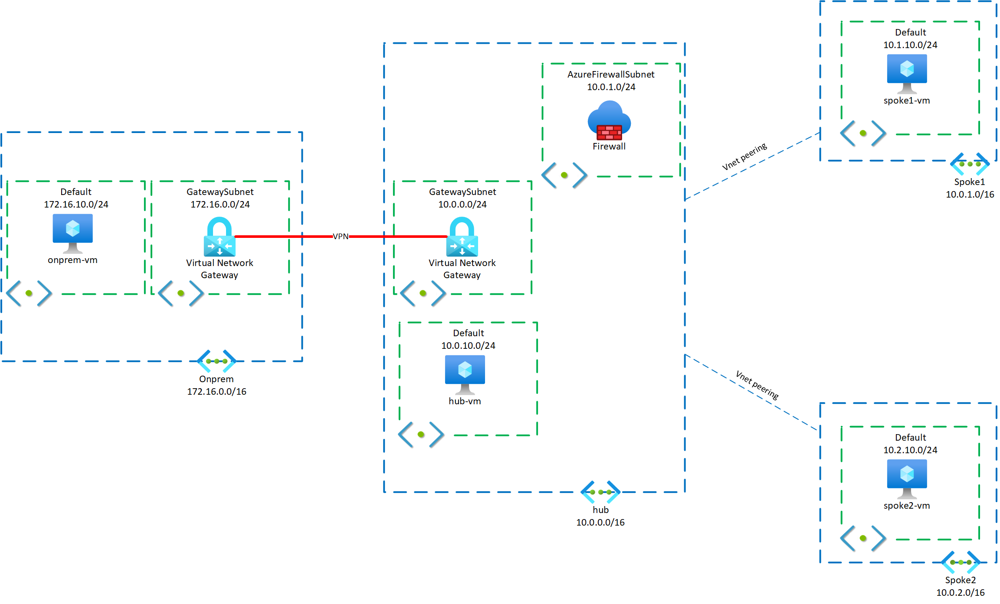

# Module 2: Firewalling Traffic

[< Previous Module](./01-HubNSpoke-basic.md) - **[Home](../README.md)** - [Next Module >](./03-Asymmetric.md)

## Introduction

In this module you will be fine-tuning your routing design to send VM traffic through the firewall.

## Description

In this module we will deploy an Azure Firewall to the hub VNet, so that you have the topology described here:

We will make sure that the firewall is inspecting all outbound Internet traffic from the Virtual Machines, as well as traffic going from Azure to onprem. Finally, we will direct traffic from the Internet through the firewall for inspection and redirection to the web servers installed on each cloud VM in the last module.

## Method

**_IMPORTANT: Be sure to create ALL resources in Canada Central region._**

**_IMPORTANT: If a parameter is not specified, it should not be set OR the default is acceptable._**

1. Modify the `hub` VNet so that it contains a new subnet for the firewall per the table below:

   | Name  | Address Space | Subnets Name: Address Space                                                               |
   | ----- | ------------- | -------------------------------------------------------------------------------------------- |
   | `Hub` | 10.0.0.0/16   | GatewaySubnet: 10.0.0.0/24  default: 10.0.10.0/24 **AzureFirewallSubnet: 10.0.1.0/24** |

1. Create a new Azure Firewall with the following settings:

   - Name: `hub-fw`
   - Tier: `standard`
   - Firewall management: `Use policy`
   - Create a new policy named: `hub-policy`
   - VNet: `hub`
   - Create a new public IP named: `fw-pip`

   The firewall will take between 5-10 minutes to deploy.

1. While the firewall is deploying, create three route tables:
   1. Name: `hub`
   1. Propagate gateway routes: `yes`
   1. Routes:

Once the firewall has deployed, go to Azure Firewall Manager, and locate the `hub-policy`

## Success Criteria

1. The spoke VMs can reach each other.
1. The Azure Firewall should inspect traffic from any VM in the hub or the spoke going to the public Internet or to onprem.
1. The Azure Firewall should inspect traffic from any on-premise client going to the hub or any spokes.
1. The solution should be independent of network administrators adding, changing or removing prefixes in the on-premises network in the future.
1. A web server should be installed on each VM, and it should be reachable from the public Internet.
1. The participants should be able to show Azure Firewall logs, to demonstrate that traffic traverses the firewall.
1. The participants should be able to identify the client source IP as seen by each web server and explain it.

## Related documentation

- [What is Azure Firewall](https://docs.microsoft.com/azure/firewall/overview)
- Example troubleshooting pages that can easily be deployed on the web platform of your choice:
  - [Inspector Gadget](https://github.com/jelledruyts/InspectorGadget) (.netcore)
  - [whoami](https://github.com/erjosito/whoami/tree/master/api-vm) (python/flask)
  - [KUARD](https://github.com/kubernetes-up-and-running/kuard) (container)
- [Azure Routing Cheat Sheet](Resources/routing-cheat-sheet.md)

## Advanced Modules (Optional)

If you want to dive even deeper in the technology:

- Deploy a second VM in spoke1, in the same subnet that you used for the web server in spoke1, and make sure that intra-subnet VM goes through the Azure Firewall as well. This is what sometimes is called microsegmentation or zero-trust segmentation.
- Configure the Azure Firewall with a combination of Network Rules and Application Rules, and explain the order in which the rules are matched. Are you able to use Application Rules for traffic sent from the public Internet to the web servers over DNAT?
