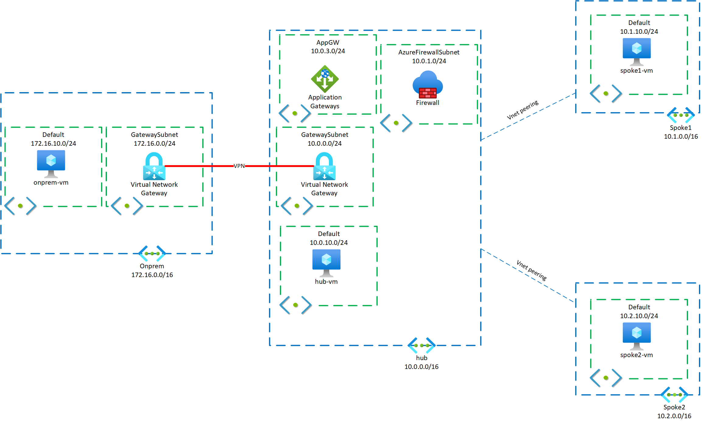

# Module 4: Application Gateway

[< Previous Module](./02-AzFW.md) - **[Home](../README.md)**

## Introduction

In this module you will integrate an Application Gateway in the design. The Application Gateway is a Layer 7 aware service that can perform multiple functions at your edge, such as path-based load balancing, HTTPS offload, Web Application Firewalling, and more. In this module, we will use an Application Gateway to solve the problem in the last module where accessing different web sites behind the firewall required the use of different ports.

The configuration we are implementing places the Application Gateway in-line with the Firewall. There are multiple other options available for how to route traffic, depending on the requirements of your particular applications.

## Description

## Method

**_IMPORTANT: Be sure to create ALL resources in Canada Central region._**

**_IMPORTANT: If a parameter is not specified, it should not be set OR the default is acceptable._**

1. Modify the `Hub` VNet to have an additional subnet as follows:

   | Name  | Address Space | Subnets Name: Address Space                                                                                           |
   | ----- | ------------- | ------------------------------------------------------------------------------------------------------------------------ |
   | `Hub` | 10.0.0.0/16   | GatewaySubnet: 10.0.0.0/24  default: 10.0.10.0/24 AzureFirewallSubnet: 10.0.1.0/24 **AppGwSubnet: 10.0.2.0/24** |

   **Note**: Unlike other services such as the Azure Firewall, an App Gateway subnet does not have a naming restriction; however, it is still only capable of having an Application Gateway deployed into it.

1. Create a route table:

   1. Name: `hub-appgw`
   1. Propagate gateway routes: `no`

1. Once the route table is created, add the following routes:
   | Name | Address prefix | Next hop type | Next hop IP address |
   | ------ | -------------- | ----------------- | ------------------- |
   | hub | 10.0.0.0/16 | Virtual appliance | 10.0.1.4 |
   | spoke1 | 10.1.0.0/16 | Virtual appliance | 10.0.1.4 |
   | spoke2 | 10.2.0.0/16 | Virtual appliance | 10.0.1.4 |
1. Associate the `hub-appgw` route table to the `AppGwSubnet` created above.
1. Create a Public IP Address.

   - Name: `appgw-pip`
   - Availability Zone: `No Zone`

   Once the PIP is created, record the IP address.

1. Create an Application Gateway.

   **Basics**

   - Name: `hub-appgw`
   - Tier: `Standard`
   - Instance count: `1`
   - Sku Size: `Small`
   - Virtual Network/Subnet: `Hub/AppGwSubnet`

   **Frontends**

   - Frontend IP address type: `Public`
   - Use existing, `appgw-pip` created above

   **Backends**

   Add 2:

   1. - Name: `Spoke1`
      - Target type: `IP address or FQDN`
      - Target: `10.1.10.4`

   1. - Name: `Spoke2`
      - Target type: `IP address or FQDN`
      - Target: `10.2.10.4`

   **Configuration**

   Add 2 Rules:

   1. - Rule Name: `Spoke1`

      **Listener**

      - Listener name: `spoke1`
      - Frontend IP: `Public`
      - Listener type: `Multi-site`
      - Host Name: `spoke1.<public.ip.of.appgw>.nip.io`

      **Backend Targets**

      - Backend target: `spoke1`
      - HTTP settings: Add new:
        - HTTP settings name: `spoke1`

   1. - Rule Name: `Spoke2`

      **Listener**

      - Listener name: `spoke2`
      - Frontend IP: `Public`
      - Listener type: `Multi-site`
      - Host Name: `spoke2.<public.ip.of.appgw>.nip.io`

      **Backend Targets**

      - Backend target: `spoke2`
      - HTTP settings: Add new:
        - HTTP settings name: `spoke2`

   The App Gateway will take about 10 minutes to deploy.

   **Note:** [nip.io](https://nip.io/) is a small DNS rebinding service. It translates a request for an A address like `spoke1.1.2.3.4.nip.io` (among other accepted formats) and returns the IP `1.2.3.4` (in that case). It makes testing sites like this easy since you don't need to modify your own DNS records.

1. While the App Gateway is deploying, stop the `hub-vm`, `spoke1-vm`, and `spoke2-vm` VMs.
1. Once they are stopped, dissociate their public IP addresses from their NICs.
   1. Click on a public IP address from the Public IP Address resource list.
   1. Click the "Dissociate" button.
1. Restart the VMs.
1. Browse to the firewall policy we created in the last module. Remove all of the DNAT rules.
1. From each of the `hub`, `spoke1`, and `spoke2` routing tables, remove the `fw-pip` route.
1. Once the App Gateway has deployed, from a browser, browse to `spoke1.<public.ip.of.appgw>.nip.io`. You should see the `spoke1-vm` web page.
1. Browse to `spoke2.<public.ip.of.appgw>.nip.io`. You should see the `spoke2-vm` web page.

## Discussion

1. Can you explain the flow of traffic, from your web browser/client IP to the web servers and back?

## Success Criteria

1. You can access the web sites in each VM in the hub and in the spokes through the Application Gateway via different URLs

## Related documentation

- [What is Azure Application Gateway](https://docs.microsoft.com/azure/application-gateway/overview)
- [How an Application Gateway works](https://docs.microsoft.com/azure/application-gateway/how-application-gateway-works)
- [nip.io](https://nip.io/)
